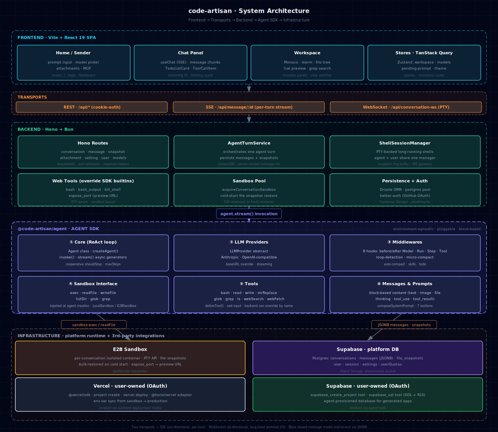

<div align="center">
  

# CodeArtisan

A web coding agent + reusable Agent SDK — hand-rolled ReAct loop, middlewares, tools, and a pluggable sandbox abstraction. Built from first principles (no Vercel AI SDK / LangChain) as a hands-on way to learn modern coding-agent internals.

[English](./README.md) · [简体中文](./README.zh-CN.md)

  <p>
    <a href="https://code-artisan-production.up.railway.app"></a>
    
    
  </p>
</div>

## 🎬 Demo

**Live**: <https://code-artisan-production.up.railway.app>

https://github.com/user-attachments/assets/449acf6a-e12d-4dd5-a826-5ae6d825d68a

## ✨ Features

- **Hand-rolled Agent SDK.** No Vercel AI SDK, no LangChain — a first-principles ReAct loop with multi-provider support, middlewares (auto-compact, quota, file-tracking, loop-detection), tools, and a sandbox abstraction. All pluggable.

- **Third-party integrations (Vercel / Supabase) for full-stack generation & deploy.** The agent spins up a real Supabase project, writes tables + RLS policies via SQL, then deploys a Hono backend via the `@hono/vercel` adapter. Sandbox-to-prod env var sync included.

- **Shareable workspaces.** One click mints an unlisted public link — visitors browse the full chat transcript, file tree, and run the live app. Read-only, no login required. Great for portfolios and bug reports.

- **Version control built in.** Every agent turn is a checkpoint. Preview prior versions, restore selectively, all from inline chips in the chat. Restore is event-sourced — AI context is trimmed to the active chain.

- **MCP support.** Built-in MCP marketplace — install with one click and the agent automatically picks up the new tools on the next turn.

- **Built-in Skills system.** Ships with skills like fullstack scaffolding and Supabase database operations; the agent reads them on demand to accelerate common tasks.

- **Sandboxed isolation.** Every conversation runs in its own [E2B](https://e2b.dev) sandbox; file snapshots restore the workspace on cold start. When using the Agent SDK standalone, swap to `LocalSandbox` to run on your own machine.

- **Full-featured workspace.** Live preview, Monaco editor, PTY-backed xterm terminals (agent and user share one session manager), file tree + full-text search, **element picker** (click any DOM node in the preview to context the AI), **runtime error capture** (one-click "ask AI to fix") — all over a single conversation-scoped WebSocket.

## 🏛️ Architecture

<p align="center">
  
</p>

### Monorepo

| Package | What it does |
|---|---|
| [`@code-artisan/agent`](./packages/agent) | Environment-agnostic Agent SDK — ReAct loop, providers, tools, middlewares, sandbox interface |
| [`@code-artisan/backend`](./packages/backend) | Hono + Bun server — turn orchestration, persistence, BYO OAuth, sandbox lifecycle, PTY sessions |
| [`@code-artisan/frontend`](./packages/frontend) | Vite + React 19 SPA — workspace UI, Monaco, xterm, live preview, share viewer |
| [`@code-artisan/iframe-runtime`](./packages/iframe-runtime) | Vite plugin injected into sandbox apps — captures runtime errors + drives the element picker over postMessage |
| [`@code-artisan/cli`](./packages/cli) | Terminal UI for the agent SDK (Ink-based). Scaffolded — future home for a standalone CLI |
| [`@code-artisan/shared`](./packages/shared) | Shared types: message blocks, model catalog, conversation shapes, iframe protocol |

## 🛠️ Tech Stack

**Frontend** — Vite 6 · React 19 · TypeScript 5.9 · Tailwind v4 · shadcn/ui · TanStack Router · TanStack Query · Zustand · Monaco · xterm.js · react-resizable-panels

**Backend** — Bun · Hono 4 · Drizzle ORM · Postgres · better-auth (GitHub OAuth) · `@vercel/sdk` · `@supabase/supabase-js` · anthropic-ai/sdk · modelcontextprotocol/sdk

**Sandbox** — E2B Code Interpreter (PTY API)

**Infrastructure** — Supabase (Postgres + Object Storage) · Railway / Docker (deploy)

**Models** — Any Anthropic or OpenAI-compatible gateway (switch via `LLM_BASE_URL`)

## 🚀 Quick Start

### Prerequisites

- **Node.js** ≥ 20, **pnpm** ≥ 9, **Bun** ≥ 1.x
- **[E2B](https://e2b.dev)** API key
- **[Supabase](https://supabase.com)** project (Postgres + Storage bucket named `attachments`)
- **LLM API key** — Anthropic, or any OpenAI-compatible gateway
- **GitHub OAuth App** (for user login)
- **Vercel + Supabase OAuth Apps** (for the BYO deploy / DB integrations) — see [`.env.example`](./.env.example) for registration links

### Setup

```bash
git clone https://github.com/lhz960904/code-artisan.git
cd code-artisan
pnpm install

# Configure environment
cp .env.example .env
# Fill in DATABASE_URL, SUPABASE_*, LLM_API_KEY, E2B_API_KEY, GitHub/Vercel/Supabase OAuth, ...

# Push schema to your database
pnpm --filter @code-artisan/backend run db:push

# (First time only) Build the E2B sandbox template
pnpm sandbox:build

# Start frontend (:3000) + backend (:3001) in parallel
pnpm dev
```

Open <http://localhost:3000>.

### Build for production

```bash
pnpm build
pnpm --filter @code-artisan/backend run start
```

A `Dockerfile` is included for containerized deploys (Railway-ready).

## 🤝 Issues & PRs

Issues and PRs welcome — open one any time. For Chinese-speaking folks who'd rather chat directly, add me on WeChat:

<p align="center">
  
</p>

## 📄 License

MIT © [lhz960904](https://github.com/lhz960904)
