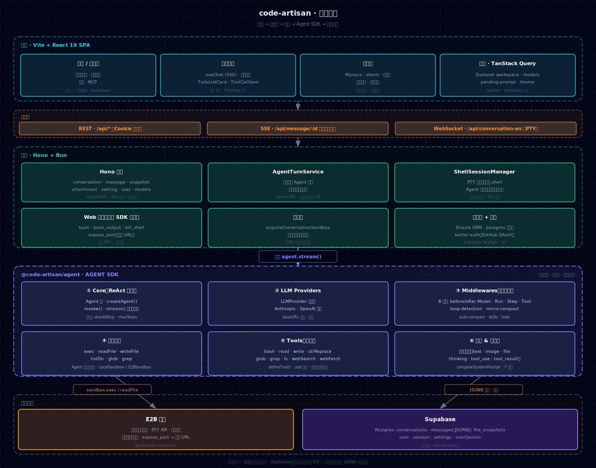

<div align="center">
  

# CodeArtisan

一个 Web AI 编码 Agent —— 个人实战项目，用来端到端探索：怎么从零写一个 Agent SDK、怎么把代码执行扔进沙箱、怎么搭一个真正能用的工作区 UI。

[English](./README.md) · [简体中文](./README.zh-CN.md)

  <p>
    
    
  </p>
</div>

## 🎬 Demo

https://github.com/user-attachments/assets/449acf6a-e12d-4dd5-a826-5ae6d825d68a

## ✨ 项目特点

- **自研 Agent SDK。** 不是套壳 AI SDK，也不是包一层 LangChain。从第一性原理写的 ReAct 循环，Provider、Middleware、Tool、Sandbox 全部可插拔。Block-based 多态消息模型端到端贯通，不丢信息。
- **默认沙箱化。** 每段对话独立运行在 [E2B](https://e2b.dev) 沙箱中，文件快照机制让冷启动也能恢复完整工作区。
- **原生 MCP 支持。** 内置 MCP marketplace，安装即用，下一轮对话 Agent 自动接入新工具，无需改配置。
- **实时预览。** `expose_port` 把沙箱里启动的 dev server 直接接到前端 iframe，不需要 ngrok、不需要手工配置。
- **真正的工作区。** Monaco 编辑器、PTY 驱动的 xterm 终端（Agent 与用户共享同一个 session 管理器）、文件树 + 全文搜索，全部走一条会话级 WebSocket。
- **双传输架构。** SSE 跑单轮 Agent 输出，长连接 WebSocket 跑双向终端 I/O，各司其职。
- **中间件系统。** quota 计费、文件变更追踪、循环检测、micro-compact、auto-compact、计划级 todo —— 每一项都是一个可独立替换的中间件。
- **主题切换。** Tailwind v4 `@theme` token 驱动，浅色/深色开箱即用。

## 🏛️ 架构

<p align="center">
  
</p>

### Monorepo 包结构

| 包 | 职责 |
|---|---|
| [`@code-artisan/agent`](./packages/agent) | 环境无关的 Agent SDK —— ReAct 循环、Provider、Tool、Middleware、Sandbox 抽象 |
| [`@code-artisan/backend`](./packages/backend) | Hono + Bun 服务端 —— 单轮编排、持久化、鉴权、沙箱生命周期、PTY 会话 |
| [`@code-artisan/frontend`](./packages/frontend) | Vite + React 19 单页应用 —— 工作区 UI、Monaco、xterm、实时预览 |
| [`@code-artisan/cli`](./packages/cli) | Agent SDK 的终端 UI（基于 Ink） |
| [`@code-artisan/shared`](./packages/shared) | 共享类型：消息块、模型目录、会话结构 |

## 🛠️ 技术栈

**前端** — Vite 6 · React 19 · TypeScript 5.9 · Tailwind v4 · shadcn/ui · TanStack Router · TanStack Query · Zustand · Monaco · xterm.js · `react-resizable-panels`

**后端** — Bun · Hono 4 · Drizzle ORM · Postgres · `better-auth`（GitHub OAuth）· `@anthropic-ai/sdk` · `@modelcontextprotocol/sdk`

**沙箱** — E2B Code Interpreter（PTY API）

**基础设施** — Supabase（Postgres + 对象存储）· Railway / Docker（部署）

**模型** — Claude Opus 4.7 · Claude Sonnet 4.6 · 任何 OpenAI 兼容网关（通过 `LLM_BASE_URL` 切换）

## 🚀 快速开始

### 前置条件

- **Node.js** ≥ 20
- **pnpm** ≥ 9
- **Bun** ≥ 1.x
- 一个 **[E2B](https://e2b.dev)** API key
- 一个 **[Supabase](https://supabase.com)** 项目（Postgres + 名为 `attachments` 的存储桶）
- **LLM API key** —— Anthropic 官方，或任意 OpenAI 兼容网关（如 `aihubmix`）
- **GitHub OAuth App**（callback 填 `http://localhost:3001/api/auth/callback/github`）

### 安装

```bash
git clone https://github.com/lhz960904/code-artisan.git
cd code-artisan
pnpm install

# 配置环境变量
cp .env.example .env
# 填写 DATABASE_URL、SUPABASE_*、LLM_API_KEY、E2B_API_KEY、GitHub OAuth ...

# 推送数据库 schema
pnpm --filter @code-artisan/backend run db:push

# 仅首次：构建 E2B 沙箱模板
pnpm sandbox:build

# 同时启动前端 (:3000) 与后端 (:3001)
pnpm dev
```

打开 <http://localhost:3000> 即可。

### 生产构建

```bash
pnpm build
pnpm --filter @code-artisan/backend run start
```

仓库内附 `Dockerfile`，开箱即可部署到 Railway 等平台。

## 🗺️ Roadmap

完整列表见 [TODO.md](./TODO.md)。`P1` 重点：

- [ ] 一键部署（Vercel）
- [ ] 内置数据库能力（Supabase）
- [ ] 元素选择回填（点击预览中的元素，自动写入对话框）
- [ ] 版本控制 + 分享链接
- [ ] 自定义规则（`Agents.md`）
- [ ] i18n 框架

`P3` 想法：Plan 模式、子 Agent、记忆系统、刷新页面恢复流式。

## 🤝 Issue 和 PR

欢迎随时提 issue 或 PR。有不清楚的、想聊聊实现思路、或者就是想交流，加我微信：

<p align="center">
  
</p>

## 📄 License

MIT © [lhz960904](https://github.com/lhz960904)
